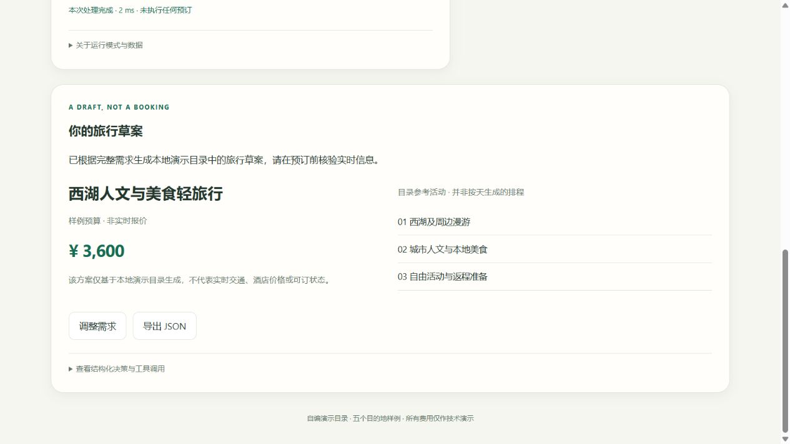

# Wayloom Travel · 织途旅行

把中文旅行描述整理成结构化需求。信息不全时继续追问，补齐后从本地样例目录生成行程草案，支持 JSON 导出。



项目用于验证需求解析、工具调用和本地模型部署。目录只有五个目的地样例，
费用是固定演示值，不查询实时票价或酒店库存，也不下单。

## 先试规则版

需要 Python 3.12 和 uv：

```shell
git clone https://github.com/boombap777/wayloom-travel.git
cd wayloom-travel
uv sync --frozen
uv run --no-sync travel-itinerary-web
```

打开 [本地页面](http://127.0.0.1:8504/)，点击“杭州三日 · 完整示例”，再生成草案。
也可以选择“还没想好 · 补全示例”，看看系统如何追问缺失信息。
页面右上方会标明运行模式；默认规则版不使用大模型。

若要体验真实模型，下载 [v0.1.0 模型包](https://github.com/boombap777/wayloom-travel/releases/tag/v0.1.0)，
按[模型启动说明](PUBLICATION.md#真实模型模式)准备 llama.cpp 并启动。
端口冲突时加 `--port 8514`。服务只监听本机，不应直接暴露到公网。

## 实现思路

解析器先提取出发地、目的地、日期、天数、人数、预算和偏好。
必填信息齐全后才调用 `search_trip_options`；返回的草案注明数据来自 `demo_catalog_v1`。
当前生成的是活动大纲，不是覆盖任意天数的详细路线。

规则解析、HF adapter 和 llama.cpp 共用一套输入输出校验和规划逻辑，
网页、HTTP API 与命令行也调用同一规划器。模型输出不合法时明确报错，不悄悄切换成规则结果。

## 本地模型实验

在 RTX 4060 Laptop GPU 上，对 Qwen3-1.7B 做了 4-bit QLoRA 微调。
训练、验证、测试分别使用 480、80、120 条合成样本，测试集固定后再比较模型。

| 推理方式 | 结构校验通过率 | 动作匹配率 | 字段 micro-F1 |
| --- | ---: | ---: | ---: |
| HF adapter | 100% | 100% | 99.88% |
| GGUF + LoRA，原始输出 | 68.33% | 60.83% | 79.21% |
| GGUF + LoRA，有限修复后 | 83.33% | 75.83% | 90.16% |

有限修复只处理遗漏的工具参数：从模型已输出且校验通过的需求中复制，不补造字段。
GGUF 部署后的质量低于 HF adapter，表中分别列出两种推理方式的结果。

这些指标衡量固定合成样本上的结构化输出，不代表真实旅行推荐质量。
[HF 评测记录](reports/model_eval/qwen3-1.7b-travel-sft-v1__travel-eval-v1.0.json) ·
[GGUF 评测记录](reports/deployment/llama_cpp_full_frozen_eval_v1.json)

## 开发与复现

- [训练与评测方法](docs/experiment-protocol.md)
- [本地部署和性能测试](docs/local-deployment.md)
- [模型来源与历史标注更正](docs/model-provenance.md)
- [安装及发布说明](PUBLICATION.md) · [开发规格](DEV_SPEC.md)
- [自动化测试](https://github.com/boombap777/wayloom-travel/actions)：本地运行 `uv run --no-sync pytest`，不需要模型。

目前只完成 SFT，未执行 DPO；合成数据的人工复核也尚未完成。
源码采用 [MIT](LICENSE)，Qwen 模型及其衍生制品保留 Apache-2.0 许可，见[第三方说明](THIRD_PARTY_NOTICES.md)。
